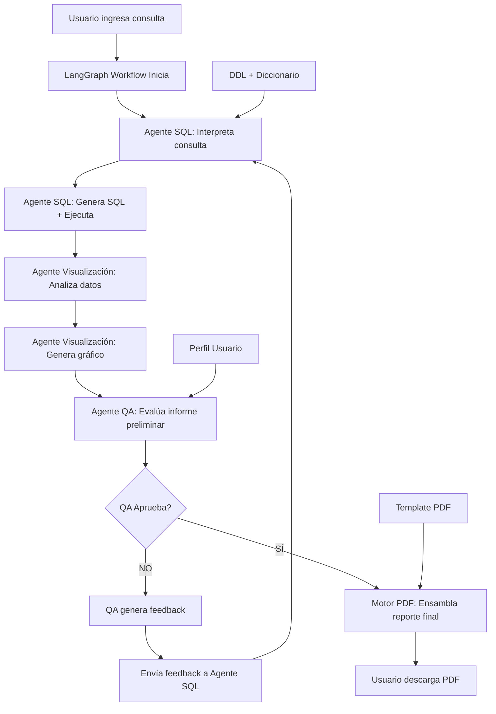

# Plan de Arquitectura del Sistema - Chatbot Text-to-Report

## A. Componentes Clave

### 1. Frontend - Interfaz de Usuario
- **Componente**: Aplicación web/chat interface
- **Responsabilidades**:
  - Recepción de consultas en lenguaje natural
  - Visualización del progreso del procesamiento
  - Descarga de reportes PDF generados
- **Tecnología**: React.js con componentes de chat o Streamlit para prototipado rápido

### 2. LangGraph Workflow Orchestrator
- **Componente**: Núcleo del sistema multiagente
- **Responsabilidades**:
  - Orquestación del flujo de trabajo entre agentes
  - Gestión de estados y transiciones
  - Control del ciclo de validación y corrección
- **Tecnología**: LangGraph (Python)

### 3. Agente 1: Analista SQL (Text-to-SQL)
- **Componente**: LLM especializado en generación SQL
- **Responsabilidades**:
  - Interpretación de consultas en lenguaje natural
  - Generación de consultas SQL optimizadas
  - Ejecución de consultas contra la base de datos
  - Refinamiento basado en feedback del QA
- **Context**: DDL completo + Diccionario de datos inyectado en system prompt

### 4. Agente 2: Experto en Visualización
- **Componente**: LLM + Motor de visualización
- **Responsabilidades**:
  - Análisis automático del tipo de datos resultantes
  - Selección inteligente del tipo de gráfico apropiado
  - Generación de visualizaciones de alta calidad
- **Tecnología**: Matplotlib/Plotly + LLM para decisión de visualización

### 5. Agente 3: Analista de Calidad (QA)
- **Componente**: LLM validador supervisory
- **Responsabilidades**:
  - Validación de coherencia entre consulta original y resultado
  - Generación de feedback detallado para correcciones
  - Aprobación final del informe
- **Context**: Consulta original + Perfil de usuario + Resultado preliminar

### 6. Motor de Generación PDF
- **Componente**: Servicio de ensamblaje de reportes
- **Responsabilidades**:
  - Compilación de todos los elementos del reporte
  - Generación de PDF profesional con marca de agua
  - Gestión de templates y formato consistente
- **Tecnología**: ReportLab o WeasyPrint

### 7. Gestión de Contexto y Metadatos
- **Componente**: Sistema de inyección de contexto
- **Responsabilidades**:
  - Mantenimiento del DDL y diccionario de datos actualizado
  - Gestión de perfiles de usuario
  - Cache de metadatos de la base de datos
- **Tecnología**: Vector Store (ChromaDB/Pinecone) + PostgreSQL metadata

### 8. Base de Datos Objetivo
- **Componente**: PostgreSQL (< 50 tablas)
- **Características**:
  - Esquema estático y bien definido
  - Metadatos extraíbles automáticamente
  - Optimizada para consultas analíticas

## B. Flujo de Proceso (Diagrama de Flujo Lógico)



### Secuencia Detallada:

1. **Inicialización (LangGraph State)**
   - Usuario envía consulta natural
   - Sistema carga contexto: DDL, diccionario, perfil usuario
   - Inicializa estado del workflow

2. **Procesamiento SQL (Agente 1)**
   - LLM recibe: consulta + contexto completo BBDD
   - Genera consulta SQL óptima
   - Ejecuta contra PostgreSQL
   - Almacena resultados en estado

3. **Generación Visualización (Agente 2)**
   - Analiza estructura y tipo de datos resultantes
   - LLM decide tipo de gráfico apropiado
   - Genera visualización usando matplotlib/plotly
   - Guarda imagen en estado

4. **Validación QA (Agente 3)**
   - Recibe: consulta original + datos + gráfico + perfil usuario
   - LLM evalúa coherencia y completitud
   - **Si rechaza**: genera feedback específico → vuelve a paso 2
   - **Si aprueba**: continúa a ensamblaje

5. **Ensamblaje PDF (Motor PDF)**
   - Compila todos los elementos
   - Aplica template profesional
   - Añade marca de agua IA
   - Genera PDF descargable

## C. Stack Tecnológico Recomendado

### Core Framework
- **LangGraph**: Orquestación de workflows multiagente
- **LangChain**: Integración con LLMs y herramientas
- **Python 3.11+**: Lenguaje base

### LLM y AI
- **OpenAI GPT-4** o **Anthropic Claude**: Para todos los agentes LLM
- **OpenAI Function Calling**: Para estructurar salidas de agentes
- **Instructor**: Para validación de schemas de respuesta

### Base de Datos y Conectividad
- **PostgreSQL**: Base de datos objetivo
- **SQLAlchemy**: ORM y ejecutor de consultas
- **psycopg2**: Driver PostgreSQL
- **Alembic**: Migraciones de esquema

### Visualización
- **Plotly**: Gráficos interactivos de alta calidad
- **Matplotlib**: Gráficos estáticos adicionales
- **Seaborn**: Visualizaciones estadísticas

### Generación PDF
- **WeasyPrint**: HTML to PDF con CSS avanzado
- **Jinja2**: Templates HTML para reportes
- **Pillow**: Procesamiento de imágenes

### Gestión de Contexto
- **ChromaDB**: Vector store para metadatos y contexto
- **tiktoken**: Conteo de tokens para optimización de prompts

### Infraestructura y Deployment
- **FastAPI**: API REST para frontend
- **Redis**: Cache y gestión de sesiones
- **Docker**: Containerización
- **Nginx**: Proxy reverso y servicio de archivos estáticos

### Frontend (Opcional - MVP puede ser CLI/API)
- **Streamlit**: Prototipado rápido de interfaz
- **React.js + Axios**: Frontend productivo
- **Tailwind CSS**: Styling moderno

### Monitoring y Logs
- **Langsmith**: Tracing específico para LangChain/LangGraph
- **Sentry**: Error tracking
- **Prometheus + Grafana**: Métricas de sistema

### DevOps y Testing
- **pytest**: Testing framework
- **black + isort + flake8**: Code formatting
- **pre-commit**: Git hooks
- **GitHub Actions**: CI/CD

## D. Consideraciones Arquitectónicas Especiales

### 1. Gestión de Estado en LangGraph
```python
class ReportState(TypedDict):
    query: str
    user_profile: dict
    sql_query: str
    data_results: List[dict]
    visualization: bytes
    qa_feedback: Optional[str]
    qa_approved: bool
    iteration_count: int
    final_pdf: Optional[bytes]
```

### 2. Context Injection Strategy
- DDL completo pre-cargado en vector store
- System prompts con ejemplos few-shot específicos por tipo de consulta
- Metadatos de tablas cachados para acceso rápido

### 3. Error Handling y Resilencia
- Circuit breaker para llamadas a LLM
- Retry logic con exponential backoff
- Fallback a consultas SQL simples si falla generación compleja

### 4. Seguridad
- SQL injection prevention vía parameterización
- Rate limiting por usuario
- Validación estricta de consultas generadas antes de ejecución
- Sanitización de datos en reportes PDF

### 5. Performance Optimization
- Cache de visualizaciones comunes
- Pre-compilación de metadatos de BBDD
- Streaming de generación PDF para reportes grandes
- Async processing con background tasks